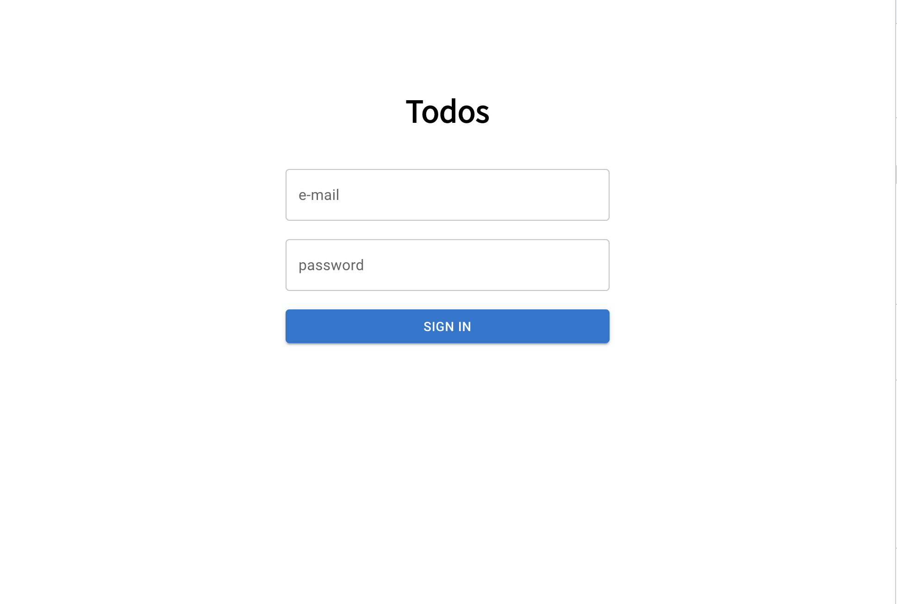
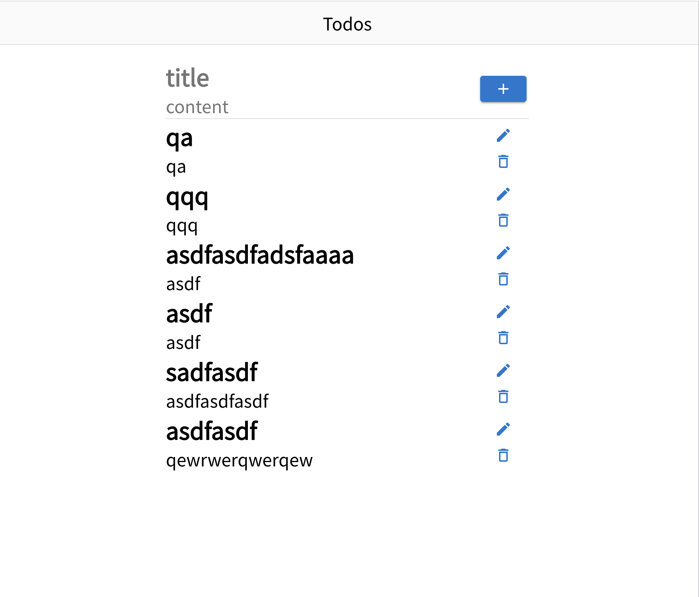

# :: 원티드 프리온보딩 챌린지 프론트엔드 코스 사전과제 안내 & API

# Week 1-2 공부한 내용 정리

- [[React] react-router를 사용한 라우팅과 window.location의 차이](https://80000coding.oopy.io/b2ba558a-187d-4945-a135-230e8a775931)

- [[TypeScript] 유틸리티 타입 (Pick, Omit, Partial, Record 등)](https://80000coding.oopy.io/edb8d09e-7ef9-4de2-9cf3-3b2d61d0c3e7)
- [[React] react-router useNavigate의 wrapper component 뜯어보기](https://80000coding.oopy.io/7e14b2e2-b0ca-482a-9592-97f1153024c5)
- [[React/TS] useRef object배열로 관리하기 + 리팩토링(함수 관심사 분리, Utility Type)](https://80000coding.oopy.io/774fd94b-686d-4a95-aeab-b8f0a376f1c6)

- [React Query로 리팩토링하기](https://80000coding.oopy.io/b0655b92-43e8-435b-97a6-244fbf875637) - 작성중...

추가로 공부한 내용

- [TypeScript Type Chellenge](https://80000coding.oopy.io/a79bf2b8-6612-4258-9c13-6b20ee85e4d0) - 작성중...

# Week 1-1 사전과제 구현 (꾸준히 업데이트 중!)

  

# 사전과제 진척도

## Assignment 1 - Login / SignUp

- /auth 경로에 로그인 / 회원가입 기능을 개발합니다
  - 로그인, 회원가입을 별도의 경로로 분리해도 무방합니다
  - [x] 최소한 이메일, 비밀번호 input, 제출 button을 갖도록 구성해주세요
- 이메일과 비밀번호의 유효성을 확인합니다
  - [x] 이메일 조건 : 최소 `@`, `.` 포함
  - [x] 비밀번호 조건 : 8자 이상 입력
  - [x] 이메일과 비밀번호가 모두 입력되어 있고, 조건을 만족해야 제출 버튼이 활성화 되도록 해주세요
- 로그인 API를 호출하고, 올바른 응답을 받았을 때 루트 경로로 이동시켜주세요
  - [x] 응답으로 받은 토큰은 로컬 스토리지에 저장해주세요
  - [x] 다음 번에 로그인 시 토큰이 존재한다면 루트 경로로 리다이렉트 시켜주세요
  - [x] 어떤 경우든 토큰이 유효하지 않다면 사용자에게 알리고 로그인 페이지로 리다이렉트 시켜주세요

## Assignment 2 - Todo List

- Todo List API를 호출하여 Todo List CRUD 기능을 구현해주세요
  - [ ] 목록 / 상세 영역으로 나누어 구현해주세요
  - [x] Todo 목록을 볼 수 있습니다.
  - [x] Todo 추가 버튼을 클릭하면 할 일이 추가 됩니다.
  - [x] Todo 수정 버튼을 클릭하면 수정 모드를 활성화하고, 수정 내용을 제출하거나 취소할 수 있습니다.
  - [x] Todo 삭제 버튼을 클릭하면 해당 Todo를 삭제할 수 있습니다.
- 한 화면 내에서 Todo List와 개별 Todo의 상세를 확인할 수 있도록 해주세요.
  - [x] 새로고침을 했을 때 현재 상태가 유지되어야 합니다.
  - [ ] 개별 Todo를 조회 순서에 따라 페이지 뒤로가기를 통하여 조회할 수 있도록 해주세요.
- 한 페이지 내에서 새로고침 없이 데이터가 정합성을 갖추도록 구현해주세요

  - [x] 수정되는 Todo의 내용이 목록에서도 실시간으로 반영되어야 합니다

  

# 개발 과정에서 고려한 부분

### Error Handling

1. error class 만들어서 throw error하기
2. error type 만들어서 return value를 판단하기

### axios interceptor

1. interceptor를 활용한 공통해더 추가 및 auth 추가
2. interceptorwrapper를 활용한 response 객체 unwrapping

### emotion

1. styled-component와 차이점
2. emotion 사용하기

### react-query
